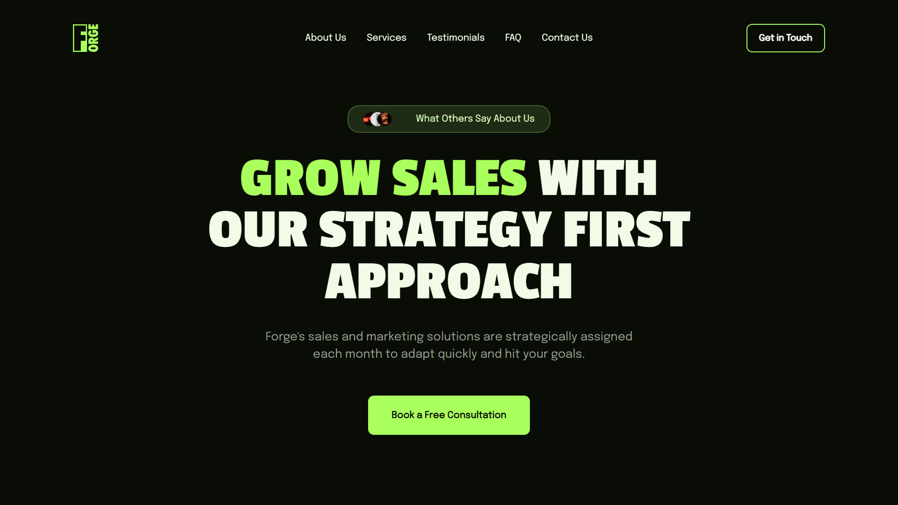

# Business Agency Website

An exceptional marketing landing page website designed to elevate your online presence built by using React. With its sleek aesthetic, intuitive interface, and a plethora of customizable elements, It's perfect solution for individuals and businesses seeking to make a lasting impression in the digital realm.

User-friendly design offers you the freedom to personalize every detail and bring your unique vision to life with unparalleled ease and precision. Whether you're a seasoned professional or just starting, it empowers you to craft a landing page that truly reflects your brand identity.

### Highlights

* 8 Well Organized Sections
* Flexible Content
* Fully Responsive
* Creative Illustrations

### Sections

* Hero
* About Us
* Services
* Key Statistics
* Testimonials
* FAQ
* Contact Us
* Footer

# Installation

> [!IMPORTANT]
> Make sure you've already installed [Node](https://nodejs.org/en) and [Git](https://git-scm.com/) on your machine earlier.

Head into your folder and clone the repo by typing these comands in your terminal to check out the project:

```bash
git clone https://github.com/artyom250/sales-project.git
cd sales-project
npm install
npm run dev
```


